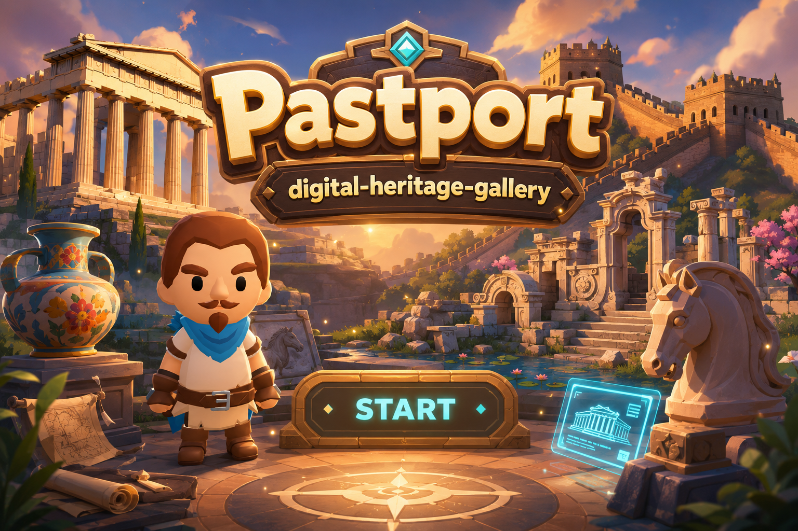

<div align="center">

# 🏛️ Pastport

### AI 驱动的多模态文化遗产沉浸式体验

**从遗址出发，穿越过去。**
*From ruins to reconstructed worlds.*

<br>



<br>


</div>

---

## ✨ 关于 Pastport

**Pastport** 是一个基于 AI 与多模态交互技术构建的数字文化遗产体验系统。

名字由 **Past + Passport** 组合而来——我们希望它像一本通往过去的“护照”，让游客不只是阅读历史，而是能够真正**进入、探索和理解历史空间**。

许多文化遗产今天只剩下残缺的墙体、地基、石柱或建筑构件。对于没有专业背景的游客来说，仅凭这些遗迹，很难想象建筑原本的完整形态、空间布局，以及它曾经存在于怎样的历史环境中。

Pastport 以一个 **3D 虚拟博物馆**作为整个体验的入口，并将：

**AI 3D 重建 · AI 世界模型 · 交互式建筑学习 · 虚拟讲解员 · 多模态内容**

整合到同一套体验流程中。

游客可以从现代博物馆出发，通过不同展品进入帕特农神庙、圆明园海晏堂、雅典卫城、长安城以及中国古代建筑等数字文化遗产场景，在“遗址现状”“建筑复原”和“历史环境”之间进行探索。

---

## 🔍 我们想解决什么？

传统文化遗产展示通常存在几个明显的理解障碍：

| 问题                | Pastport 的解决方式     |
| ----------------- | ------------------ |
| 🏛️ 遗址残缺，难以想象建筑原貌 | **AI 辅助 3D 重建与复原** |
| 🌍 单独的建筑模型缺乏历史环境  | **AI World Model** |
| 📖 长篇文字解说较为被动     | **交互式 3D 知识探索**    |
| 🗿 传统展品展示方式较为静态   | **Avatar、语音与互动文物** |

我们的目标并不是简单地“把文化遗产做成 3D”，而是探索：

> **如何利用 AI 和多模态技术，让抽象的历史知识变得可见、可进入、可探索。**

---

## 🧭 核心体验

### 01 · 重建消失的建筑

**帕特农神庙 · 圆明园海晏堂**

对于仅剩遗址或残缺结构的历史建筑，我们通过 AI 辅助的 3D 重建，让游客能够对比：

> **现在留下了什么？**
> **它曾经是什么样子？**

游客可以从遗址现状进入三维重建场景，并进一步观察建筑完整时期的形态。

这种“遗址 → 3D → 历史复原”的体验，帮助游客更直观地理解建筑原本的空间结构与外观。

---

### 02 · 进入历史世界

**雅典卫城 · 长安城**

单独展示一座建筑，并不能完整呈现它所属于的历史环境。

因此，我们进一步尝试利用 AI 生成：

**文字描述 → 视频 → 可漫步的 3D 世界模型**

从而重建建筑所在的城市、街道和历史空间。

游客可以从现代博物馆中“穿越”出去，以第一人称视角探索 AI 重构的历史环境，而不仅仅观看一个孤立的建筑模型。

---

### 03 · 在探索中学习建筑

**中国古代建筑**

传统博物馆中的建筑知识通常依赖大量文字说明。

在本项目中，我们将这些知识转化为一个可探索的交互式 3D 建筑模型。

游客可以主动查看：

* 城门
* 城墙
* 主殿
* 建筑整体布局
* 不同建筑结构

通过点击、放大、观察和进入建筑空间，让知识与真实的三维结构直接建立联系。

我们希望把：

> **“阅读建筑知识”**

转变为：

> **“探索建筑知识”**

---

### 04 · 与虚拟博物馆互动

**Avatar · 文物 · 互动展品**

虚拟博物馆不仅是不同场景之间的入口，本身也是一个完整的可交互空间。

其中包含：

* AI 虚拟讲解员
* 语音与文字导览
* Avatar 互动动画
* 3D 文物展示
* 360° 文物观察
* 可点击的文化遗产入口

游客可以自由选择自己的参观路径，而不需要按照固定顺序完成体验。

---

## 🎮 操作方式

### 博物馆场景

* **鼠标点击展品**：进入对应文化遗产体验
* **鼠标移动 / 拖动**：观察场景
* 与指定文物、Avatar 和展示内容进行互动
* 在博物馆与不同文化遗产模块之间切换

### 3D 世界探索

| 按键               | 功能   |
| ---------------- | ---- |
| `W A S D` / 方向键  | 移动   |
| 鼠标左键 + 拖动        | 调整视角 |
| `Space`          | 向上移动 |
| `Shift` / `Ctrl` | 向下移动 |

> 不同文化遗产模块的具体操作方式可能略有差异。

---

## 🚀 如何运行

克隆仓库：

```bash
git clone https://github.com/ChenyuHeee/digital-heritage-gallery.git
cd digital-heritage-gallery
```

推荐启动一个简单的本地服务器：

```bash
python -m http.server 8000
```

随后在浏览器中访问：

```text
http://localhost:8000
```

并从：

```text
index.html
```

进入整个博物馆系统。

> **注意**
>
> 当前版本的部分 JavaScript 库、3D 模型或 AI World 资源仍可能通过外部服务加载，因此部分场景运行时需要网络连接。

---

## 🛠️ 技术与工具

### Web / 3D

* Three.js
* WebGL
* HTML / CSS / JavaScript
* GLTF / GLB
* Draco Compression
* Meshopt
* KTX2 Texture
* Gaussian Splatting

### AI / Multimodal

- **Manifest AI** — AI 辅助 3D 建模、场景生成与交互原型开发
- AI 图像生成 — 为建筑重建与历史场景生成视觉参考
- AI 视频生成 — 将历史资料与文本描述转化为动态内容
- AI World Model — 将生成内容进一步转化为可探索的 3D 世界
- AI 辅助编程 — 完成交互逻辑、页面整合与原型开发
- AI Speech — 提供文化遗产语音讲解
- Avatar 与角色动画 — 提供虚拟导览与动态交互

---

## 📁 项目结构

```text
digital-heritage-gallery/
│
├── index.html
│   └── 主博物馆 / 项目入口
│
├── assets/
│   ├── pastport-cover.png      # 封面图
│   └── cover_video.mp4         # 开场动画
│
├── images/
│   ├── 雅典卫城_figure.png
│   ├── 圆明园遗址.jpg
│   └── 长安城.png
│
└── scenes/
    ├── 圆明园_final.html
    │   └── 圆明园海晏堂体验
    ├── 长安城_model.html
    │   └── 长安城世界模型
    ├── 雅典卫城与帕特农神庙.html
    │   └── 雅典卫城与帕特农神庙交互场景
    └── 中国古代建筑规制介绍_model.html
        └── 中国古建筑交互学习模型
```

---

## 💡 系统设计

整个项目采用：

### **“博物馆索引 → 深度体验”**

的整体结构。

```text
                  ┌────────────────────┐
                  │      虚拟博物馆     │
                  │      Main Hub      │
                  └─────────┬──────────┘
                            │
          ┌─────────────────┼─────────────────┐
          │                 │                 │
          ▼                 ▼                 ▼
      3D 建筑重建         世界模型          交互式学习
          │                 │                 │
     帕特农神庙         雅典卫城          中国古代建筑
       海晏堂             长安城
```

游客并不需要按照固定路线参观。

博物馆提供统一入口，而每个文化遗产模块都对应一种不同的数字文化遗产展示方式。

---

## 🚧 当前局限

目前项目仍然是一个实验性原型，因此存在一些可以进一步改进的部分。

### 建筑内部空间

目前 3D 建筑复原主要集中于：

* 外部轮廓
* 建筑立面
* 屋顶
* 整体形态

对于建筑内部的房间划分、家具、功能空间及历史陈设，还没有完成充分重建。

---

### 世界模型中的人物

当前的雅典卫城和长安城世界模型已经能够表现：

* 建筑
* 街道
* 城墙
* 历史空间

但仍然缺少真正生活在其中的历史人物。

未来可以进一步加入由 AI Agent 驱动的：

* 商人
* 工匠
* 士兵
* 祭司
* 普通市民

让数字遗产从“被复原的城市”进一步发展为“重新运行的历史社会”。

---

### 场景之间的连续性

目前从主博物馆进入不同深度体验时，场景之间仍然存在一定的割裂感。

未来可以进一步加入：

* 更自然的过渡动画
* 无缝加载
* 统一交互逻辑
* 更连续的叙事体验

让游客真正产生从：

**现代博物馆 → 古代历史空间**

进行“时空穿越”的感觉。

---

## 📚 研究背景

本项目的设计受到数字文化遗产、混合现实与虚拟 3D 重建相关研究的启发。

相关研究表明，对于缺少专业背景的普通游客而言，仅凭残存遗址往往很难理解建筑的原始空间形式，而数字重建和沉浸式技术可以帮助重新建立历史信息与空间环境之间的联系。

### References

1. De Luca, V., Barba, M. C., D'Errico, G. et al. (2023).
   *A user experience analysis for a mobile Mixed Reality application for cultural heritage*.
   Virtual Reality, 27, 2821–2837.

2. Liu, Y. (2020).
   *Evaluating visitor experience of digital interpretation and presentation technologies at cultural heritage sites: a case study of the old town, Zuoying*.
   Built Heritage, 4, 14.

3. Rodriguez-Garcia, B., Guillen-Sanz, H., Checa, D. et al. (2024).
   *A systematic review of virtual 3D reconstructions of Cultural Heritage in immersive Virtual Reality*.
   Multimedia Tools and Applications, 83, 89743–89793.

---

## 👥 项目团队

本项目为 **AI Multimodal System** 课程团队 Final Project。

项目开发过程中不同成员共同参与了：

* 3D 场景设计
* AI 内容生成
* 世界模型制作
* 交互开发
* 文化遗产资料整理
* 系统集成与测试
* 文档与展示设计

具体开发与贡献记录可通过本仓库的 Git Commit History 查看。

---


<div align="center">

### Explore the past. Understand the heritage.

**Pastport · Digital Heritage Gallery**

</div>


<div align="center">


